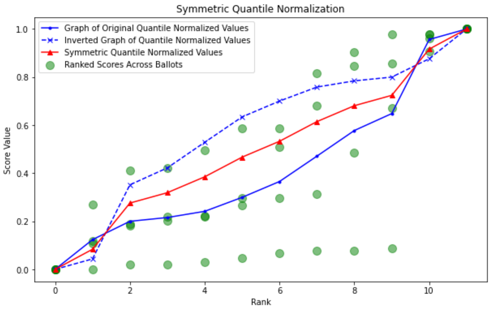
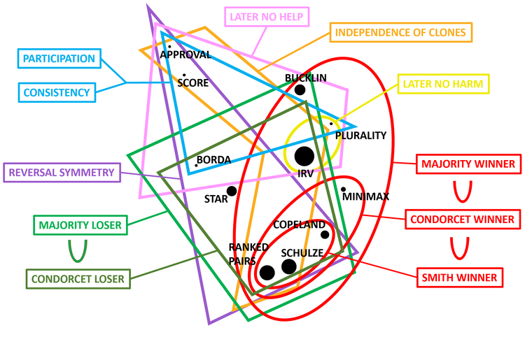

# symmetric_quantile-normalized_score
``symmetric_quantile-normalized_score`` is an implementation of symmetric quantile-normalized score voting (SQNV).

<figure>
    
</figure>

## Introduction
Invented on March 16, 2024 with significant contributions from the community at the [Voting Theory Forum](https://www.votingtheory.org/forum/), SQNV offers a novel approach to score voting by incorporating a symmetric quantile normalization process. This method aims to mitigate the impacts of [strategic voting tactics](https://en.wikipedia.org/wiki/Strategic_voting) like [bullet voting](https://en.wikipedia.org/wiki/Bullet_voting) and min-maxing.

## About SQNV
Symmetric quantile-normalized score voting (SQNV) is a voting system that modifies traditional score voting to enhance fairness and reduce susceptibility to common voting tactics like bullet voting and min-maxing. At its core, SQNV employs a normalization technique that adjusts voters' scores for candidates, ensuring that each ballot contributes equally to the final outcome.

### Process Overview

1. **Uniform Range**: Each voter's scores are set to span a $0$- $1$ scale, maintaining relative preferences but standardizing the score ranges across all ballots.
2. **Quantile Ranking**: Scores on each ballot are ranked, and a [quantile calculation](https://en.wikipedia.org/wiki/Quantile_normalization) (also see [this explanation by StatQuest](https://www.youtube.com/watch?v=ecjN6Xpv6SE&embeds_referring_euri=https%3A%2F%2Fwww.votingtheory.org%2F&source_ve_path=Mjg2NjY&feature=emb_logo)) is performed to determine the central score (ex: mean or median) for each rank across all voters.
3. **Symmetric Adjustment**: The quantile scores are then adjusted symmetrically, ensuring that the influence of high and low scores is balanced across the voting population.
4. **Tallying**: The adjusted scores are tallied for each candidate, determining the winner in a way that respects the nuanced preferences of the entire electorate.

## Motivation
SQNV is motivated by the goal of enabling reasonable normalization of score ballots to enhance comparability across voters without (1) resorting to strict rankings or (2) sacrificing certain desirable properties of score systems, such as [participation](https://en.wikipedia.org/wiki/Participation_criterion), [consistency](https://en.wikipedia.org/wiki/Reinforcement_criterion), and [independence of clones](https://en.wikipedia.org/wiki/Independence_of_clones_criterion). SQNV accomplishes this by adjusting quantile normalized score values into a forced symmetry that preserves the following "cancellation" property:

* **Cancellation**: *If an election would arrive at some result in the absence of ballots from voters* $A$ *and* $B$, *then for any ballot to be cast by voter* $A$ *that would alter that result, there must be some ballot that voter* $B$ *can cast in combination to recover the original result.*

Without this property, a voting system necessarily confers more power to influence the election's result to certain voters than it does to others---in particular, voter $A$ would be able to induce a change in the electoral result that voter $B$ would be unable to reverse. However, while cancellation is a necessary condition to prevent such intrinsic power imbalances, it is far from sufficient. Specifically, there are methods to satisfy the cancellation property without conferring almost any political equity to voters, such as a "[password attacking](https://www.votingtheory.org/forum/post/3256)" mechanism[^1]. 

[^1]: A canonical example of a password attacking mechanism is the introduction of a mandatory pair of strings for each voter: a "password" and an "attack" string. After voting closes, the mechanism uniquely prefixes each password, ensuring no two are the same, and then searches for pairs where one voter's attack string matches another's prefixed password and vice versa, resulting in both ballots being nullified as a ``cancellation pair." This mechanism theoretically allows for the possibility of ballot cancellation, but the propensity of such events can be made arbitrarily small.

In the case of SQNV, the cancellation property is achieved non-trivially by preserving the richer structure of an Abelian group, also referred to as the "point-summing" structure, of traditional score ballots. This structure offers the advantage of the reinforcement criterion and therefore also the participation criterion. This places SQNV among score and approval voting in the ``map" of voting systems. As such, SQNV cannot elect the [Condorcet winner](https://en.wikipedia.org/wiki/Condorcet_winner_criterion) (when one exists) for *every* possible ballot set, since the strict Condorcet criterion is incompatible with the participation criterion. [CHECK THIS] At the same time, unlike score and approval voting, there are instances where the independence of irrelevant alternatives (IIA) criterion is not satisfied, which may be seen as a serious compromise made by SQNV to enable score normalization. However, SQNV may still very commonly elect the Condorcet winner when one exists, and failures of IIA may also be infrequent among practical use cases. 

<figure>
    
</figure>

## Formal Definition

To begin, SQNV assumes without loss of generality that each voter's ballot has real-valued, independent scores with an attained minimum score of $0$ and an attained maximum of $1$. The method of achieving this assumption may vary---for example, an affine-projection of the ballots to the range of $[0,1]$ may be sensible in certain contexts.

Alternatively, one may by reasonable means restrict the range of valid scores to the range $[0,1]$, and then include two additional pseudo-scores of $0$ and $1$ respectively to each ballot to be automatically included in the normalization process. In the context of political elections, this alternative suggestion to enforce a uniform range may be more ethically sound, as it places the onus of utilizing the full strategic power of the ballot entirely on the voter. It also removes the would-be inconvenience of separately handling ballots with zero variation.

With the uniform range assumption met, and letting there be $m$ candidates and $n$ voters, symmetric quantile normalization of score ballots proceeds as follows:

The scores in each individual ballot are ranked in ascending order, and the values that would be associated to each rank as in an ordinary quantile normalization are computed as $q_0, q_1,\cdots, q_m$. In particular, $q_j$ is a central measure of all the scores in the $j$-th rank across the ballots of all voters, such as the mean or median. Explicitly, if we let $\sigma_j(v_i)$ denote the $j$-th ranked score on the ballot of voter $v_i$, then we define $$q_j:=\underset{i}{\text{center}}\left(\sigma_j(v_i)\right).$$
The values $q^\ast_j$ are defined from $q_j$ by the simple averaging formula $$q^\ast_j :=\frac{1}{2}\left(q_j+(1-q_{m-j})\right).$$
These new values $q^\ast_j$ are designed to satisfy a symmetrical condition, namely that $$q^\ast_{m-j}=1-q^\ast_j.$$
With this symmetrical condition satisfied, the system preserves the desirable ``cancellation" (Abelian group) property that, absent information imbalances, formally guarantees equal power to each voter. Note that the ordinary quantile normalized values $q_j$ are certainly not guaranteed to satisfy this condition.

Next, a modified quantile normalization is applied across all ballots, where rather than using the ordinary quantile normalized values $q_j$, the corresponding symmetrical values $q_j^*$ are used in their place.

Finally, the symmetric quantile normalized ballots are tallied across all voters to produce a final vector of candidate scores.

## Features

- Mitigates effects of strategic voting.
- Balances score and rank-based voting methods' advantages.
- Enhances fairness in score distribution among candidates.

## License

This project, "Symmetric Quantile Normalized Score," is licensed under the Creative Commons Attribution 4.0 International License - CC BY 4.0. This license allows others to share, copy, distribute, transmit, and adapt the work, even commercially, as long as proper attribution is given to the original author, Connor Frankston.

For the full license text, please see the [LICENSE.md](LICENSE.md) file in this repository or visit the [Creative Commons Attribution 4.0 International License](https://creativecommons.org/licenses/by/4.0/legalcode) page.

 

## Acknowledgments

A special thanks is extended to Jack Waugh and Toby Periera for their insightful intellectual engagement and concerns pertaining to the development of this system.